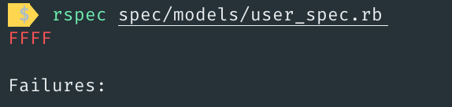
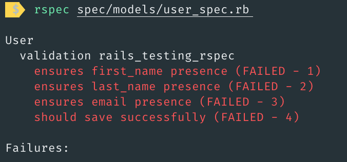

# Note for Rails with Rspec

1. In the `.rspec` file, add the line:
```
--format documentation
```

**Before:**





**After:**





2. ```before(:all)``` vs ```before(:each)```
2.1 The define
- ```before(:all)```:
  - Run when the `context/describe` block begins.
  - Run outside of transactions, so data created here will bleed into other specs.
- ```before(:each)```:
  - Run before each spec inside it.

> Generally, you'll want a clean setup for each spec so that they are independent of other specs in the same context.

2.2 Using ```before(:all)``` in RSpec will cause you lots of trouble unless you know what you are doing
*Example:*
```
describe User, 'something' do
  before :all do
    @user = User.make
  end

  it 'should so something' do
    # ...
  end

  it 'should so something else' do
    # ...
  end
end
```

If you do that, @user will not be re-created for each test. Obviously, this has significant downsides, mostly that changes of one test on that record will bleed into the next one. Also, when using DatabaseCleaner with the :deletion strategy, the record will be gone after the first spec.

*Do it right:*
```before(:each)``` is the right choice in most cases. So, for the above example we say the following and all is well.

```
describe User, 'something' do
  before :each do
    @user = User.make
  end

  # ...
end
```
Furthermore, you will probably run into trouble with your RSpec configuration block that does things in config.before(:each), as this will also be run after your individual spec's before(:all) block did things and might revert changes.

> Always use before(:each) unless you are totally sure of the impact your before(:all) block has.